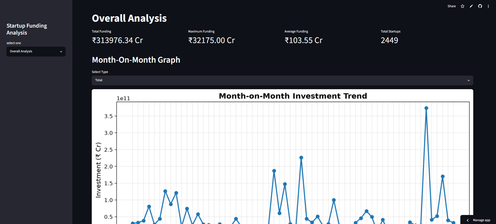
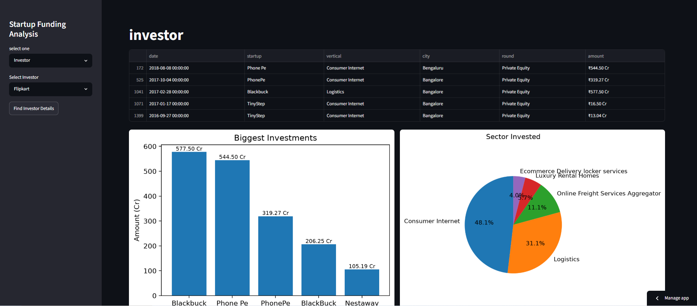
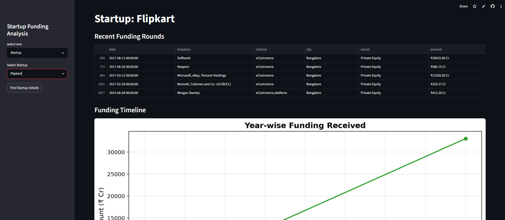

# 🚀 Startup Funding Analysis Dashboard

A data-driven dashboard built using **Python**, **Pandas**, **Matplotlib**, and **Streamlit** to analyze startup funding trends in India. This project provides interactive visualizations and insights into startups, investors, funding rounds, sectors, cities, and investment patterns.

## 📌 Features

### 📊 Overall Analysis
- Total funding raised
- Maximum funding received by a startup
- Average funding amount
- Total funded startups
- Month-on-Month funding trend (Total Investment / Number of Investments)

### 🏢 Investor Analysis
- Recent investments of the selected investor
- Biggest investments by startup
- Sector-wise investment distribution
- Investment stage (Funding Round) distribution
- City-wise investment distribution
- Year-wise investment trend
- Top investments table

### 🏆 Startup Analysis
- Search startups
- View startup-specific funding information
- (Can be extended with startup-wise analytics)

---

## 🛠️ Technologies Used

- Python
- Streamlit
- Pandas
- Matplotlib
- NumPy

---

## 📂 Project Structure

```
startup-dashboard-using-Streamlit/
│
├── main.py
├── startup_cleaned.csv
├── startup_funding.csv
├── requirements.txt
└── README.md
```

---

## 📈 Dashboard Preview

### Overall Dashboard
- KPI Metrics
- Month-on-Month Investment Trend

### Investor Dashboard
- Biggest Investments
- Sector-wise Pie Chart
- Stage-wise Pie Chart
- City-wise Pie Chart
- Year-wise Line Chart

---

## ⚙️ Installation

Clone the repository

```bash
git clone https://github.com/YOUR_USERNAME/startup-dashboard-using-Streamlit.git
```

Move into the project folder

```bash
cd startup-dashboard-using-Streamlit
```

Install dependencies

```bash
pip install -r requirements.txt
```

Run the application

```bash
streamlit run main.py
```

---

## 📊 Dataset

The dataset contains startup funding information including:

- Startup Name
- Funding Amount
- Investors
- Funding Round
- Industry (Vertical)
- Sub-Vertical
- City
- Date of Funding

---

## 📌 Future Improvements

- Startup-wise detailed analytics
- Similar Investor Recommendations
- Interactive Plotly Charts
- Download Reports
- Filters by Year and City
- Top Investors Dashboard
- Funding Prediction using Machine Learning

---

## 📷 Dashboard Screenshots

### Overall Analysis



### Investor Analysis



### Startup Analysis




## 👨‍💻 Author

**Krushna Nikam**

GitHub: https://github.com/Krushna2911

Strealit: https://startup-dashboard-using-app-gjcbyh9d8dscwahfbh7kmu.streamlit.app/

---

## ⭐ If you found this project useful

Give this repository a ⭐ on GitHub!
